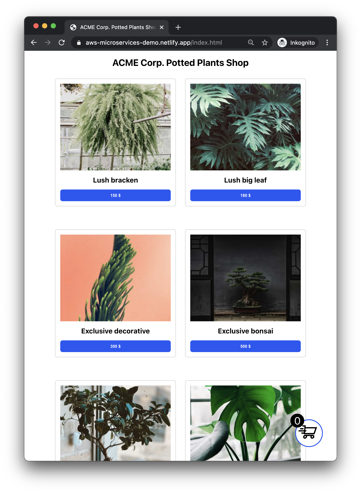
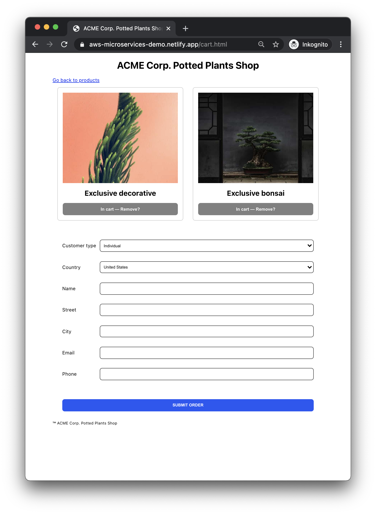
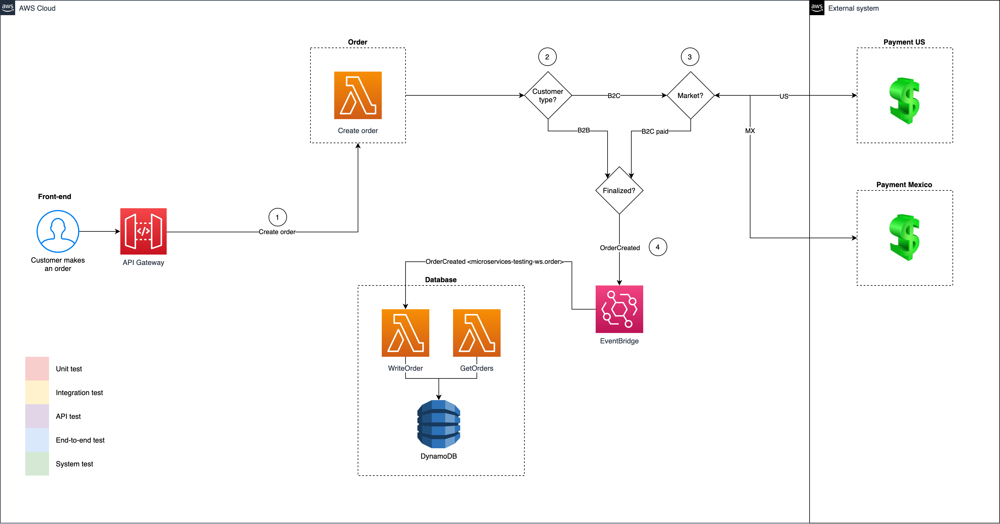

# Microservices testing workshop

This project/workshop demonstrates a number of testing types and patterns that should be helpful in testing distributed microservice architectures.

This is a testing-focused variant of the [ACME Corp. Potted Plants Web Shop: AWS microservices demo](https://github.com/mikaelvesavuori/acmecorp-microservices-webshop). The primary intent is to show you a number of testing methods applied to a common microservice use case: a web shop with a public application and a backend that does something with the order.

The second intent is to display some good documentation practices. To test something, you should _know_ it. Therefore, we will also use a few techniques and conventions to add relevant documentation to our code.

In a modern technical environment testing, development, DevOps and business merge together for better or worse. With 20+ years of Agile and modern practices behind us, helping us remember how we should work, we will aim for a developer-driven approach to testing, with a focus on automation and quality, instead of manual entry.

I've tried to adapt this to something that hopefully is enlightening to more senior developers, but accessible enough for a tester who may have had less programming time. You should be able to follow along by following the instructions as given below. You don't need to understand the details of the provided code.

This repo contains:

- Frontend application written in vanilla JS, HTML, CSS
- [AWS API Gateway](https://aws.amazon.com/api-gateway/) to handle requests
- `Order` microservice ([AWS Lambda](https://aws.amazon.com/lambda/)), which is public
- `Database` microservice ([AWS Lambda](https://aws.amazon.com/lambda/), which is "private" (at least hidden from public use, driven by an event)
- [Eventbridge](https://aws.amazon.com/eventbridge/) message bus
- [DynamoDB](https://aws.amazon.com/dynamodb/) NoSQL database

How we work with quality here:

- Linting with ESLint and Prettier
- Typescript
- Typedoc
- Quicktype
- Arkit

Testing types demonstrated:

- Static testing (linting etc)
- Unit testing
- API testing (automated and manual)
- Integration testing
- System testing
- End-to-end (E2E) testing

## Workshop

Following the workshop steps is selective and the main format will be a guided tour of a set of quality and testing approaches for serverless applications.

To follow along you will need:

- A Command Line Interface or "terminal": in Windows I recommend Windows Terminal (https://aka.ms/terminal) or PowerShell 7 (https://docs.microsoft.com/en-us/powershell/scripting/install/installing-powershell-core-on-windows?view=powershell-7.1); for Mac the built-in Terminal will work just fine
- Basic familiarity with navigating directories with your Terminal — you should be able to do most of that using `cd [directory_name]`
- Git installed (https://git-scm.com/downloads)
- Node 14 or 15 installed (https://nodejs.org/en/); ensure installation by running `node -v` and `npm -v` after installing and rebooting your CLI/Terminal
- Serverless Framework installed (https://www.serverless.com); install it by running `npm install -g serverless` in your CLI/Terminal
- Fresh AWS credentials in your system. Get them from https://polestardevhouse.awsapps.com/start/#/; click `polestar-dev-house-playground` and then `Command line or programmatic access` next to whatever your privilege type is called. Then follow https://www.serverless.com/framework/docs/providers/aws/guide/credentials/ to set credentials.

The most basic way of setting values if you are on Windows is to add your values (from the SSO console) to the below block, and run it in your terminal:

```
$env:AWS_ACCESS_KEY_ID = 'value'
$env:AWS_SECRET_ACCESS_KEY = 'value'
$env:AWS_SESSION_TOKEN = 'value'
```

Ideally you will also use:

- Visual Studio Code (https://code.visualstudio.com)
- Plugins for Prettier and ESLint; for VS Code these are at https://marketplace.visualstudio.com/items?itemName=esbenp.prettier-vscode and https://marketplace.visualstudio.com/items?itemName=dbaeumer.vscode-eslint
- Insomnia Designer (https://insomnia.rest)

Please verify basic application functionality pre-workshop.

Caveats:

- Scripts may be written in Bash (which Windows sometimes takes issue with) so I don't guarantee anything for Windows, at this stage.
- Depending on whether you have used Git before or not on your system, there may pop up issues/requirements on SSH keys and stuff: Again I can't make guarantees about your system.
  Just before the workshop you will receive a message about how to clone the code repository. Cloning means that the code is pulled to your current directory, so again, make sure you know how to move around.

## Technology

### Tooling

- [Jest](https://jestjs.io)
- [Codecept](https://codecept.io) (using [Playwright](https://github.com/microsoft/playwright))
- [Faker](https://github.com/marak/Faker.js/)
- [Quicktype](https://quicktype.io)
- [Typedoc](https://typedoc.org)
- [Arkit](https://arkit.pro/)

### Tech stack

- [Serverless Framework](https://www.serverless.com)
- [Typescript](https://www.typescriptlang.org)
- [Webpack](https://webpack.js.org)
- [local-web-server](https://github.com/lwsjs/local-web-server)

## Scenario

ACME Corp. Potted Plants is ready to launch their first version of their service. Test-driven development was not a concern, so you'll come in to ensure (after the fact) that they will launch a truly awesome service.




## Diagram




## Pre-requisites

- [Node 14+](https://nodejs.org/en/download/) installed
- [Serverless Framework 2.23.0+](https://www.serverless.com) installed
- [An Amazon Web Services (AWS) account](https://aws.amazon.com/free/)
- [AWS credentials available through your environment](https://www.serverless.com/framework/docs/providers/aws/guide/credentials/)
- Some familiarity with programming (Javascript/Typescript/Node) and command-line usage will be very helpful

## Installation and setup

- Clone or download this repo
- Navigate into the project folder or open it in your IDE (VS Code, Atom, Sublime or whatever you might be using)
- Run `npm install` to install dependencies

## API documentation (for starting)

Reference: [https://idratherbewriting.com/learnapidoc/docapis_doc_sample_responses_and_schema.html](https://idratherbewriting.com/learnapidoc/docapis_doc_sample_responses_and_schema.html).

### Create order

Change `customerType` and `market` as needed. `orgNumber` and `testId` are not required.

```
POST https://{UNIQUE_ID}.execute-api.{REGION}.amazonaws.com/dev/createOrder
{
  "name": "Raina Mayert",
  "email": "Lemuel_Mraz44@gmail.com",
  "phone": "1-355-620-4168",
  "street": "961 Jasper Forks",
  "city": "Lake Gracieside",
  "customerType": "B2B",
  "market": "US",
  "products": "BB001,BA002",
  "totalPrice": 38500,
  "orgNumber": 123123,
  "testId": 409126
}
```

## Instructions

With your beverage of choice ready, and all of the above in order, it's finally time to test the crap out of this application!

Roughly, we'll:

- Deploy the stack so it's ready to use
- Start outlining APIs (which form "contracts" or interfaces toward "consumers", i.e. applications)

### 1. Install dependencies

Run `npm run install:all`.

### 2. Check out the application

Run `npm run dev` to start up the local web server. Go to one of the provided URLs to see the site. Click around and get a feel for the app.

### 3. Discovery and baseline quality

Check out the directory structure. The backends follow the well-known Clean Architecture pattern.

Test ESLint by copying the following into a new file and saving it as `demo.js`:

```
function demo(value)
{
  var x = value;

        return (x * 0.5)
}

console.log(demo(1));
```

Now make a copy of that file, called `demo.ts`. This way we will test Typescript a bit, and see how it improves code quality. (cast number as string, set input and return types, handle errors for invalid input if for example user is not using TS and/or compiling)

More things to do:

- Test JSDoc commenting. Type `/**` in a JS/TS file and you should be shown the JSDoc helper, just press enter/return and it will scaffold it for you.
- Generate documentation with Typedoc by running `npx typedoc src`. A `docs` folder will be generated with code documentation.
- Generate architecture map with Arkit by running `npx arkit`. Check out `arkit.svg` to see how the applications are structured.

### 4. Start a local, offline backend

Run `sls offline`. Open up Insomnia and start sending some requests to your endpoints.

### 5. Deploy the backend to AWS

Run `sls deploy`. You will get a few URLs, copy those into a document so you have those handy later.

The unique ID will need to be added to a few places in the code. Search for `{{UNIQUE_ID}}` in the project and change that with your API Gateway value (10 random alpha-numeric characters).

You will also want to change the `microservices-testing-ws` name across places if you are in a shared environment, so it's more unique and doesn't create name conflicts.

### 6. Export API schema and use as Insomnia workspace

Go to [https://eu-north-1.console.aws.amazon.com/apigateway/home?region=eu-north-1#/](https://eu-north-1.console.aws.amazon.com/apigateway/home?region=eu-north-1#/) and find your API, click it, then click "Stages", "dev", "Export" tab, hover over "Export as OpenAPI 3", click "JSON", copy the snippet into a document called (for example) `microservices-api.json`. [Read more about OpenAPI 3 schema here, if you're curious](https://github.com/OAI/OpenAPI-Specification).

Open up Insomnia Designer. Drag the JSON file onto the Workspaces area. Create a new workspace from the input file. Rename it something meaningful. Click through the "Design", "Debug" and "Test" tabs to see a bit of what's going on. You will need to make a small alteration to get this to work: click on the "OpenAPI env" button thing on the left, and then "Manage environments". The "base_path" may have two slashes, if it does, edit it so it only uses a single slash. Close it or click "Done".

To run an example call, go to the "Debug" tab, click `POST /createOrder` on the left. Notice how there is a pre-populated (valid) call:

```
{
  "name": "Firstname Lastname",
  "email": "firstname.lastname@somewhere.xyz",
  "phone": "123123123123",
  "street": "Somestreet 120",
  "city": "Sometown",
  "customerType": "B2C",
  "market": "US",
  "products": "string",
  "totalPrice": 0,
  "testId": 0,
  "orgNumber": 0
}
```

This is no magic; it's already defined in `api/schema.json` and API Gateway picked it up from our `serverless.yml` configuration file under the Database service.

Now click "Send". You should get back a success status.

You can keep the JSON in your repository so other developers and testers can use it to set up their environment. Try to export the workspace! It also makes a lot of sense to add example calls like the above to your README and/or other static documentation.

### 7. Try out Quicktype schemas

Go to [https://quicktype.io](https://quicktype.io) and try out using the Order APIs expected input to generate client SDKs.

For a local demo, see `QuicktypeDemo.ts`.

If you want to look at the pre-generated (and used) one, you'll find it under `src/microservices/database/frameworks/QuicktypeOrder.ts`, where's it's used to verify correct input.

### 8. Check out unit and integration/API tests

They are located under `__tests__/integration/`. Run them with `npm run test:jest`.

### 9. Run an end-to-end test

It's located under `__tests__/e2e/`. Run it with `npm run test:e2e`. You'll first need to open up a second terminal with a local web server (`npm run dev`) for it to complete successfully.

### 10. Run a system test

It's located under `__tests__/system/`. Run it with `npm run test:system`. You will have to update the ID and region values in `__tests__/system/index.ts` to your values. This also requires that the stack is deployed with Serverless first, since this is all using live components.
